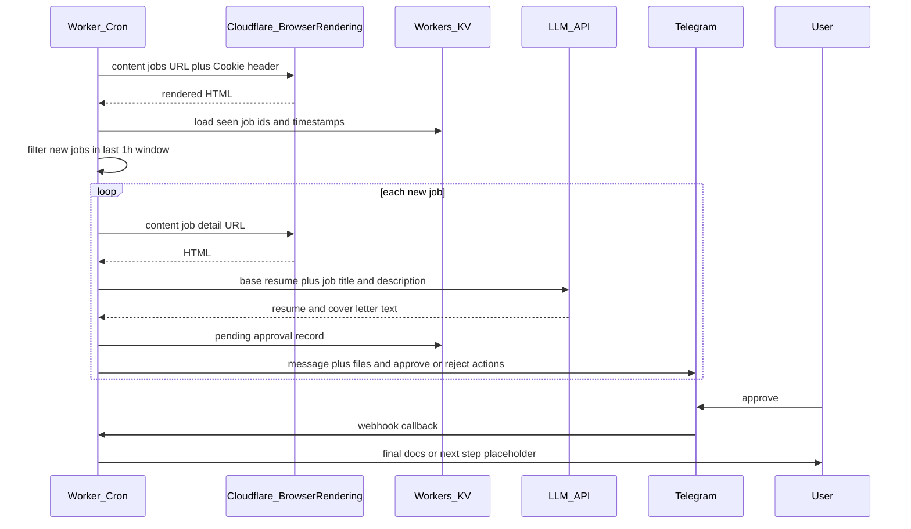

# Handshake → LLM → Telegram approval pipeline

## Context

Your workspace ([/Users/hemanth/Desktop/apper](/Users/hemanth/Desktop/apper)) has no application code yet; this is a new build. You chose **Telegram first** with a **notification interface** that can later add WhatsApp, and **no runtime preference** — the default recommendation below optimizes for aligning with **Cloudflare Browser Rendering** and simple ops.

## Recommended stack

| Piece         | Choice                                                                                                                                            | Why                                                                                                                                                     |
| ------------- | ------------------------------------------------------------------------------------------------------------------------------------------------- | ------------------------------------------------------------------------------------------------------------------------------------------------------- |
| Schedule      | [Cloudflare Workers Cron Triggers](https://developers.cloudflare.com/workers/configuration/cron-triggers/)                                        | Native hourly runs, no server to maintain                                                                                                               |
| Rendering     | [Browser Rendering REST API](https://developers.cloudflare.com/browser-rendering/rest-api/content-endpoint/) `POST .../browser-rendering/content` | Renders JS-heavy Handshake UI; pass `headers` (including `Cookie`) from your curl-derived session                                                       |
| Dedup / state | [Workers KV](https://developers.cloudflare.com/kv/) or D1                                                                                         | Store `job_id → first_seen_iso`, pending approvals, Telegram `chat_id`                                                                                  |
| LLM           | OpenAI or Anthropic HTTP API from the Worker                                                                                                      | Straightforward `fetch`; keep prompts and base resume as Worker secrets +/or [R2](https://developers.cloudflare.com/r2/) object for larger resume files |
| Messaging     | [Telegram Bot API](https://core.telegram.org/bots/api) + **webhook** to a Worker route                                                            | Send documents + inline/reply approval; later add a `MessagingProvider` interface and a WhatsApp adapter (Twilio/Meta)                                  |

**Caveat:** Workers have execution time and subrequest limits. If one cron tick must scrape **many** new jobs (dozens of Browser Rendering calls + LLM calls), split work across invocations (e.g. enqueue job IDs in KV and process N per run) or move the orchestrator to a small Node cron that **only** calls the Browser Rendering REST API — same design, different host.

## High-level flow

## Handshake-specific notes

- **Cookies:** Store the full `Cookie` header (and any required headers from your working curl) as encrypted secrets (`wrangler secret`). Session expiry is expected — document a manual refresh or a separate “health check” alert when listing fetch fails.
- **Parsing:** Handshake is likely a client-rendered app. Plan on **iterating selectors** against real HTML from Browser Rendering (stable `data-*` attributes or JSON embedded in `__NEXT_DATA__`-style scripts if present). Avoid brittle CSS-only selectors where possible.
- **“Past 1 hour” rule:** Prefer **server-provided timestamps** from the listing payload if available; otherwise use **first time this Worker saw `job_id`** stored in KV and treat “new in the last hour” as `now - first_seen < 1h` on the **hourly run** (equivalent to “discovered since last run” if you run exactly hourly). Align the rule explicitly with product behavior you want.
- **Handshake upload:** Treat as **phase 2**. Public APIs for “upload application” are uncommon; automation may violate ToS or require fragile logged-in browser flows. Default “approved” action: **send final PDFs/DOCX (or plain text files) via Telegram** for manual upload; optionally spike Playwright-in-Browser-Rendering only after you confirm policy and feasibility.

## Telegram approval UX (minimal viable)

- Send a message per job: **title**, **short LLM summary**, and attachments (e.g. `.md` or `.txt` for resume and letter; add PDF generation later if desired).
- Use **inline keyboard** callbacks (`approve_<id>`, `reject_<id>`) or reply keywords; verify webhook with a secret path token.
- Map `callback_query.from.id` to an **allowlisted** Telegram user id (your account) so random users cannot approve.

## Secrets and config (illustrative)

- `CF_ACCOUNT_ID`, `CF_API_TOKEN` (Browser Rendering permission)
- `HANDSHAKE_COOKIE` (or full header blob), optional extra headers
- `OPENAI_API_KEY` or `ANTHROPIC_API_KEY`
- `TELEGRAM_BOT_TOKEN`, `TELEGRAM_ALLOWED_USER_ID`, `TELEGRAM_WEBHOOK_SECRET`
- Base resume: secret multiline text or R2 key

## Implementation phases

1. **Spike:** One-off script or Worker route that calls Browser Rendering `content` with your NYU jobs URL + cookies; log HTML length and locate listing + detail selectors (no LLM yet).
2. **Cron + KV:** Hourly job: parse listings, upsert `job_id` + `first_seen`, compute “new in window,” fetch details only for those ids.
3. **LLM module:** Prompt templates: inputs = job title, description, your base resume; outputs = tailored resume + cover letter; cap tokens and handle failures (notify you with error, skip or retry).
4. **Telegram:** Register webhook; send notifications; handle approve/reject; on approve, send “final” bundle (same files or regenerated with a “final polish” prompt — your choice).
5. **Abstraction:** `MessagingProvider` with `TelegramProvider` + stub `WhatsAppProvider` for later.
6. **Optional later:** PDF/DOCX generation (external service or library in a Node sidecar if Worker constraints bite), Handshake apply automation spike.

## Risk checklist

- Session/cookie rotation and 403/redirect handling
- Rate limits on Handshake and Browser Rendering quotas
- PII: job data and resume in logs — minimize logging, use redaction
- Legal/ToS: automated access and application submission

## Deliverable in this repo

A **Wrangler-based** TypeScript Worker project: `src/cron.ts` (scheduled), `src/telegram-webhook.ts` (HTTP), shared `handshake/`, `llm/`, `notify/` modules, `wrangler.toml` with KV binding and cron expression, plus a short README for secret setup and curl-derived cookie refresh (no new markdown unless you want it — you can ask to omit README).