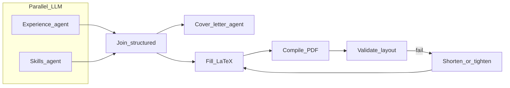
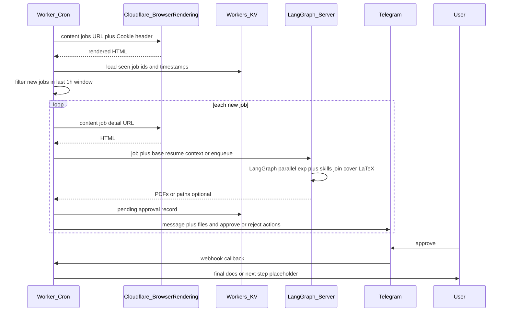

# Handshake → LangGraph → Telegram approval pipeline

## Context

Your workspace ([/Users/hemanth/Desktop/apper](/Users/hemanth/Desktop/apper)) has no application code yet; this is a new build. You chose **Telegram first** with a **notification interface** that can later add WhatsApp. **Resume and cover letter generation use [LangGraph](https://langchain-ai.github.io/langgraph/) on a server** (Python recommended): parallel agents, merge, LaTeX compile, and optional human-in-the-loop fit the graph model well. Scraping can stay on **Cloudflare Browser Rendering** (Worker cron or server calling the REST API).

## Recommended stack

| Piece | Choice | Why |
| ----- | ------ | --- |
| Schedule | [Cloudflare Workers Cron](https://developers.cloudflare.com/workers/configuration/cron-triggers/) **and/or** server cron (APScheduler, Celery, etc.) | Hourly discovery; server can own end-to-end job runs if you prefer one deployable |
| Rendering | [Browser Rendering REST API](https://developers.cloudflare.com/browser-rendering/rest-api/content-endpoint/) `POST .../browser-rendering/content` | Renders JS-heavy Handshake UI; pass `headers` (including `Cookie`) |
| Dedup / state | Workers KV, D1, or server DB (Postgres/SQLite) | `job_id → first_seen`, LangGraph checkpoints, pending Telegram approvals |
| Resume pipeline | **LangGraph** on a **Python server** | Parallel nodes (experience agent + skills agent) → join → cover letter node → LaTeX fill → `pdflatex`/`xelatex` subprocess → validate (page count, log/overfull hints) → optional repair loop (shorten content, recompile) |
| LLM | OpenAI or Anthropic from LangGraph nodes | Structured outputs (JSON) from experience/skills nodes for deterministic template fill |
| LaTeX | Subprocess + template with placeholders | Not an LLM step; gate with bounded retries if page count or layout checks fail |
| Messaging | [Telegram Bot API](https://core.telegram.org/bots/api) + webhook (Worker or server route) | Documents + inline approve/reject; later `MessagingProvider` + WhatsApp stub |

**Caveat:** If the hourly tick does **many** Browser Rendering + graph runs, **enqueue job IDs** (KV/Redis/DB) and process N per invocation, or run scrape on Worker and **POST** each new job to the server to start a LangGraph run.

## Resume generation (LangGraph)

- **Inputs:** Job title + description; base resume (text or structured); LaTeX template.
- **Parallel (fan-out):**
  - **Experience agent:** Reads base resume + job; outputs **structured** selections (roles/bullets, optional rewrites).
  - **Skills agent:** Outputs **structured** skills for the job.
- **Join:** Single merged artifact for downstream steps (avoid drift between resume and letter).
- **Cover letter agent:** Runs **after** join; consumes job + experience output + skills output.
- **LaTeX path:** Fill template from merged structured data → compile (often two passes) → **validate:** page count (`pdfinfo` / library), optional log parse for overfull/underfull; “whitespace at bottom” as **soft** signal (template tuning + shorten loop). If validation fails, **repair node** (LLM shortens under constraints) → recompile; cap retries (e.g. 2–3).

**Caveat:** Workers have execution time and subrequest limits. **Do not run LaTeX or long LangGraph graphs inside a Worker**; keep that on the server. Workers remain suitable for scrape triggers, webhooks, or thin proxies.

## High-level flow

## Handshake-specific notes

- **Cookies:** Store the full `Cookie` header (and any required headers from your working curl) as encrypted secrets (`wrangler secret` or server env). Session expiry is expected — document a manual refresh or a separate “health check” alert when listing fetch fails.
- **Parsing:** Handshake is likely a client-rendered app. Plan on **iterating selectors** against real HTML from Browser Rendering (stable `data-*` attributes or JSON embedded in `__NEXT_DATA__`-style scripts if present). Avoid brittle CSS-only selectors where possible.
- **“Past 1 hour” rule:** Prefer **server-provided timestamps** from the listing payload if available; otherwise use **first time this Worker saw `job_id`** stored in KV and treat “new in the last hour” as `now - first_seen < 1h` on the **hourly run** (equivalent to “discovered since last run” if you run exactly hourly). Align the rule explicitly with product behavior you want.
- **Handshake upload:** Treat as **phase 2**. Public APIs for “upload application” are uncommon; automation may violate ToS or require fragile logged-in browser flows. Default “approved” action: **send final PDFs/DOCX (or plain text files) via Telegram** for manual upload; optionally spike Playwright-in-Browser-Rendering only after you confirm policy and feasibility.

## Telegram approval UX (minimal viable)

- Send a message per job: **title**, **short LLM summary**, and attachments (PDF/text from LangGraph output).
- Use **inline keyboard** callbacks (`approve_<id>`, `reject_<id>`) or reply keywords; verify webhook with a secret path token.
- Map `callback_query.from.id` to an **allowlisted** Telegram user id (your account) so random users cannot approve.

## Secrets and config (illustrative)

- `CF_ACCOUNT_ID`, `CF_API_TOKEN` (Browser Rendering permission)
- `HANDSHAKE_COOKIE` (or full header blob), optional extra headers
- `OPENAI_API_KEY` or `ANTHROPIC_API_KEY`
- `TELEGRAM_BOT_TOKEN`, `TELEGRAM_ALLOWED_USER_ID`, `TELEGRAM_WEBHOOK_SECRET`
- Base resume: secret multiline text, server file, R2, or DB

## Implementation phases

1. **Spike:** One-off script or Worker route that calls Browser Rendering `content` with your NYU jobs URL + cookies; log HTML length and locate listing + detail selectors (no LLM yet).
2. **Cron + KV:** Hourly job: parse listings, upsert `job_id` + `first_seen`, compute “new in window,” fetch details only for those ids.
3. **LangGraph server:** Define graph: parallel experience + skills (structured JSON via tool/schema), join node, cover letter node, LaTeX render + validate + bounded repair loop; persist checkpoints if you want resumability; expose HTTP or queue consumer to receive “new job” payloads from scrape side.
4. **Integration:** Scrape side enqueues or HTTP-calls server per new job; server returns or uploads artifacts to object storage; Telegram step receives PDFs/text.
5. **Telegram:** Register webhook; send notifications; handle approve/reject; on approve, send final bundle or trigger final graph segment if needed.
6. **Abstraction:** `MessagingProvider` with `TelegramProvider` + stub `WhatsAppProvider` for later.
7. **Optional later:** Handshake apply automation spike (policy-dependent).

## Risk checklist

- Session/cookie rotation and 403/redirect handling
- Rate limits on Handshake and Browser Rendering quotas
- LaTeX in container/host images (TeX Live footprint)
- PII: job data and resume in logs — minimize logging, use redaction
- Legal/ToS: automated access and application submission

## Deliverable in this repo

- **TypeScript Worker (optional but useful):** `src/cron.ts` (scheduled), `src/telegram-webhook.ts` (HTTP), `handshake/`, `notify/`, `wrangler.toml` + KV.
- **Python service:** `langgraph` app (e.g. `server/` or `resume_graph/`): graph definition, prompts, LaTeX template dir, Dockerfile or `pyproject.toml` with TeX Live in image for compile.
- **README:** Secrets, cookie refresh, how Worker and server call each other.

LangGraph.js on Node is possible; the plan assumes **Python LangGraph** unless you standardize on one runtime.
