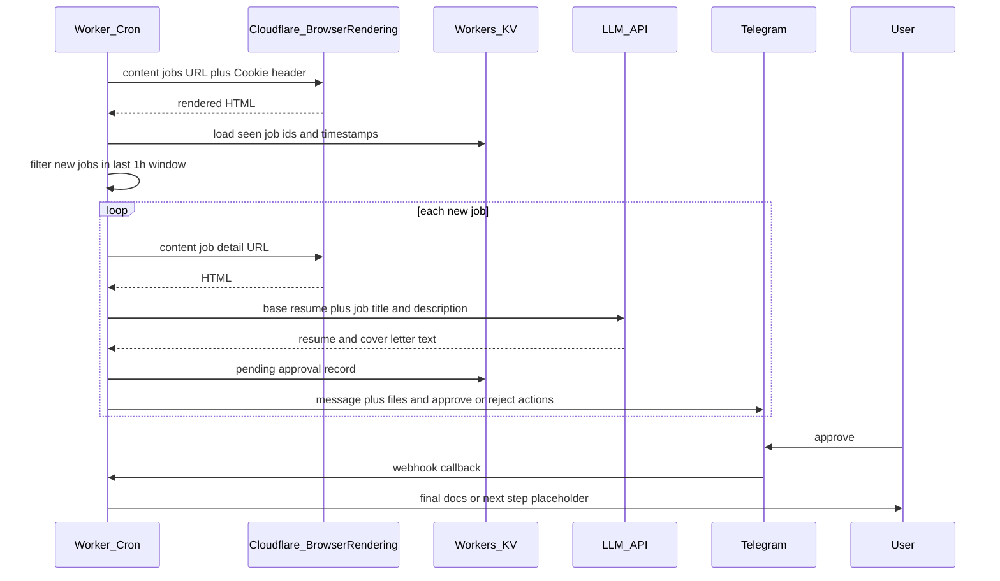

# Handshake → LLM → Telegram approval pipeline

Automated flow: hourly fetch of NYU on-campus jobs from Handshake (via Cloudflare Browser Rendering with your session cookies), dedupe and filter to recent postings, fetch job details, generate a tailored resume and cover letter with an LLM, notify you on Telegram for approval, then deliver final documents (Handshake upload deferred).

## Architecture

| Piece | Choice |
|--------|--------|
| Schedule | Cloudflare Workers Cron Triggers |
| Rendering | [Browser Rendering REST API](https://developers.cloudflare.com/browser-rendering/rest-api/content-endpoint/) — `POST .../browser-rendering/content` with `Cookie` (and other headers) from your working browser/curl session |
| State | Workers KV — `job_id → first_seen`, pending approvals |
| LLM | OpenAI or Anthropic from the Worker (`fetch`) |
| Messaging | Telegram Bot API + webhook; optional later: WhatsApp via a shared `MessagingProvider` |

If one cron run must process many jobs (many Browser Rendering + LLM calls), split work across ticks (KV queue) or run a small Node cron that only calls the Browser Rendering API.

## Flow



## Handshake notes

- **Cookies:** Put the full `Cookie` header from a working request in secrets (`wrangler secret`). Sessions expire — refresh manually or alert when listing fetch fails.
- **Parsing:** Handshake is JS-heavy; iterate on selectors against HTML from Browser Rendering (e.g. embedded JSON, `data-*` attributes).
- **“Past 1 hour”:** Prefer timestamps from the listing if present; otherwise treat “new” as first time the worker stored `job_id`, and include if `now - first_seen < 1h` (or align with hourly runs as “since last run”).
- **Applying on Handshake:** Phase 2 — default is sending final files over Telegram for manual upload.

## Telegram

- Per job: title, short summary, attachments (e.g. `.md` / `.txt`).
- Inline keyboard: `approve_<id>` / `reject_<id>`; webhook URL includes a secret token.
- Allowlist your Telegram user id for callbacks.

## Secrets (illustrative)

| Secret | Purpose |
|--------|---------|
| `CF_ACCOUNT_ID` | Cloudflare account |
| `CF_API_TOKEN` | Token with Browser Rendering |
| `HANDSHAKE_COOKIE` | Session cookie string (or full header blob) |
| `OPENAI_API_KEY` or `ANTHROPIC_API_KEY` | LLM |
| `TELEGRAM_BOT_TOKEN` | Bot |
| `TELEGRAM_ALLOWED_USER_ID` | Your numeric user id |
| `TELEGRAM_WEBHOOK_SECRET` | Path or verify token for webhook |
| Base resume | Multiline secret or R2 object |

## Local development (once the Worker exists)

```bash
npm install
npx wrangler dev
npx wrangler secret put HANDSHAKE_COOKIE
# ... other secrets
npx wrangler deploy
```

Set the Telegram webhook to your Worker route (see Bot API `setWebhook`).

## Risks

- Cookie rotation, 403s, redirects  
- Handshake and Browser Rendering rate limits  
- Minimize logging of PII (resume, job text)  
- Check Handshake terms before automating apply flows  

## Repo layout (target)

- `src/` — Worker entry, cron handler, Telegram webhook  
- `handshake/` — Browser Rendering client, listing/detail parsing  
- `llm/` — prompts and API client  
- `notify/` — `MessagingProvider`, Telegram (and stub WhatsApp)  
- `wrangler.toml` — KV binding, cron schedule  

This README is the markdown specification for the project; implement the Worker code to match.
