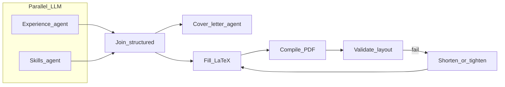
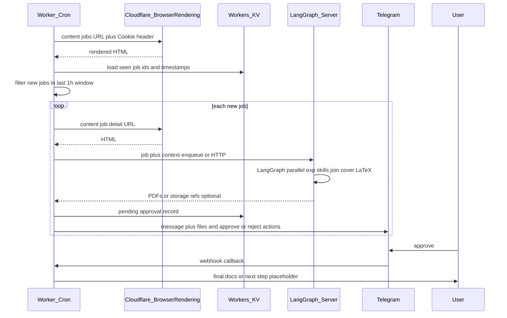

# Handshake → LangGraph → Telegram approval pipeline

Automated flow: hourly fetch of NYU on-campus jobs from Handshake (via Cloudflare Browser Rendering with your session cookies), dedupe and filter to recent postings, fetch job details, then a **Python server running [LangGraph](https://langchain-ai.github.io/langgraph/)** builds a tailored resume (parallel experience + skills agents, LaTeX compile/validate) and a cover letter that consumes the merged agent outputs. Telegram notifies you for approval; final documents are delivered (Handshake upload deferred).

## Architecture

| Piece | Choice |
|--------|--------|
| Schedule | Cloudflare Workers Cron and/or server cron — hourly discovery; server can own full job runs if you prefer one deployable |
| Rendering | [Browser Rendering REST API](https://developers.cloudflare.com/browser-rendering/rest-api/content-endpoint/) — `POST .../browser-rendering/content` with `Cookie` (and other headers) from your working browser/curl session |
| State | Workers KV, D1, or server DB — `job_id → first_seen`, LangGraph checkpoints (optional), pending Telegram approvals |
| Resume pipeline | **LangGraph** on a **Python server** — see [Resume generation (LangGraph)](#resume-generation-langgraph) |
| LLM | OpenAI or Anthropic inside LangGraph nodes; **structured JSON** from experience/skills nodes for template fill |
| LaTeX | Subprocess (`pdflatex` / `xelatex`) + template; not an LLM step; validate page count and layout signals, bounded repair loop |
| Messaging | Telegram Bot API + webhook (Worker or server); optional later: WhatsApp via `MessagingProvider` |

**Split:** Keep Browser Rendering and thin cron/webhooks on Cloudflare if you want; **do not** run LaTeX or long LangGraph graphs inside a Worker. The server exposes an HTTP (or queue) entrypoint; the scrape side enqueues or `POST`s each new job payload.

If one hourly tick must process many jobs, enqueue IDs (KV/Redis/DB) and process N per run, or POST each new job to the server to start a LangGraph run.

## Resume generation (LangGraph)

- **Inputs:** Job title + description; base resume (text or structured); LaTeX template with placeholders.
- **Parallel (fan-out):**
  - **Experience agent:** Reads base resume + job; outputs **structured** selections (roles/bullets, optional rewrites).
  - **Skills agent:** Outputs **structured** skills aligned to the job.
- **Join:** One merged artifact for all downstream steps (keeps resume and letter consistent).
- **Cover letter agent:** Runs **after** the join; input = job posting + experience output + skills output.
- **LaTeX path:** Fill template from merged structured data → compile (often two passes) → **validate:** page count (`pdfinfo` or a PDF library), optional log parse for overfull/underfull boxes; “whitespace at bottom” as a **soft** signal (template tuning + shorten loop). On failure, a **repair** node (LLM shortens under constraints) → recompile; **cap retries** (e.g. 2–3).



LangGraph.js on Node is possible; this doc assumes **Python LangGraph** unless you standardize on one runtime.

## End-to-end flow



## Handshake notes

- **Cookies:** Put the full `Cookie` header from a working request in secrets (`wrangler secret` or server env). Sessions expire — refresh manually or alert when listing fetch fails.
- **Parsing:** Handshake is JS-heavy; iterate on selectors against HTML from Browser Rendering (e.g. embedded JSON, `data-*` attributes).
- **“Past 1 hour”:** Prefer timestamps from the listing if present; otherwise treat “new” as first time the worker stored `job_id`, and include if `now - first_seen < 1h` (or align with hourly runs as “since last run”).
- **Applying on Handshake:** Phase 2 — default is sending final files over Telegram for manual upload.

## Telegram

- Per job: title, short summary, attachments (PDF/text).
- Inline keyboard: `approve_<id>` / `reject_<id>`; webhook URL includes a secret token.
- Allowlist your Telegram user id for callbacks.

## Secrets (illustrative)

| Secret | Purpose |
|--------|---------|
| `CF_ACCOUNT_ID` | Cloudflare account |
| `CF_API_TOKEN` | Token with Browser Rendering |
| `HANDSHAKE_COOKIE` | Session cookie string (or full header blob) |
| `OPENAI_API_KEY` or `ANTHROPIC_API_KEY` | LLM |
| `TELEGRAM_BOT_TOKEN` | Bot |
| `TELEGRAM_ALLOWED_USER_ID` | Your numeric user id |
| `TELEGRAM_WEBHOOK_SECRET` | Path or verify token for webhook |
| Base resume | Multiline secret, file on server, or object storage |

## Local development (target)

**Worker (TypeScript):**

```bash
npm install
npx wrangler dev
npx wrangler secret put HANDSHAKE_COOKIE
npx wrangler deploy
```

**LangGraph server (Python):** use `pyproject.toml` or `requirements.txt`, a TeX Live (or similar) image or host install for LaTeX, env vars for LLM keys; run Uvicorn/FastAPI or your job worker.

Set the Telegram webhook to your Worker or server route (see Bot API `setWebhook`).

## Risks

- Cookie rotation, 403s, redirects  
- Handshake and Browser Rendering rate limits  
- LaTeX supply chain in Docker/images  
- Minimize logging of PII (resume, job text)  
- Check Handshake terms before automating apply flows  

## Repo layout (target)

- `src/` — Worker entry, cron handler, Telegram webhook (optional if server owns Telegram)  
- `handshake/` — Browser Rendering client, listing/detail parsing  
- `server/` or `resume_graph/` — LangGraph graph, prompts, LaTeX templates, compile/validate helpers  
- `notify/` — `MessagingProvider`, Telegram (and stub WhatsApp)  
- `wrangler.toml` — KV binding, cron schedule  

This README is the markdown specification for the project; implement Worker + LangGraph server to match.
